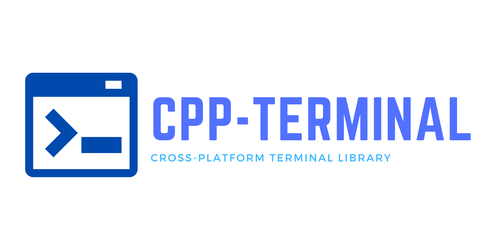

  

`CPP-Terminal` is a small and simple library for writing platform independent terminal applications. It works on Windows, MacOS and Linux and offers a simple programming interface. It
supports colors, keyboard input and has all the basic features to write any
terminal application.

Until 2021, CPP-Terminal used to be a single header library. Now, CPP-Terminal consists out of multiple small and usage oriented headers:
- `cpp-terminal/base.hpp`: everything for basic Terminal control
- `cpp-terminal/input.hpp`: functions for gathering input
- `cpp-terminal/prompt.hpp`: some variations of different prompts
- `cpp-terminal/window.hpp`: a fully managed terminal window for terminal user interfaces (TUI)
- `cpp-terminal/version.hpp`: macros with cpp-terminal's version number

The library uses private header for platform dependent code:
- `cpp-terminal/private/conversion.hpp`: Various conversions
- `cpp-terminal/private/platform.hpp`: platform dependent code

CPP-Terminal tries to be a small and simple replacement for ncurses. This approach keeps the code small and maintainable, but also easy to extend it's functionality. We limit ourselves to a subset of features that work on all supported platforms without needing to worry about style differences or other changes. Any application written with `CPP-Terminal` will work everywhere out of the box natively, without emulation or extra work. The small codebase makes CPP-Terminal easy to debug and extend, as well as understanding what happens behind the scenes in the library's core.

## Examples
We have created serval examples to show possible use cases of CPP-Terminal and to get you started more quickly. Every example works natively on all platforms in the exact same way:
- [colors.cpp](examples/colors.cpp): basic color, style and unicode demo
- [kilo.cpp](examples/kilo.cpp): the [kilo](https://github.com/snaptoken/kilo-src) text editor
  ported to C++ and `CPP-Terminal` instead of using Linux specific API
- [menu.cpp](examples/menu.cpp): An interactive menu using only the contents of `cpp-terminal/base.hpp`
- [menu_window.cpp](examples/menu_window.cpp): An interactive menu using the fully managed windowing system from `cpp-terminal/window.hpp`
- [keys.cpp](examples/keys.cpp): Interactively shows the keys pressed

## Supported platforms

| Platform          | Supported versions | Coverage by unit test |
|-------------------|--------------------|-----------------------|
| Windows           | 10 and higher*     | MSVC                  |
| (Windows) MSYS2   | All supported      | /                     |
| (Windows) Cygwin  | All supported      | /                     |
| (Windows) MinGW   | All supoorted      | /                     |
| MacOS             | All supported      | Apple-clang           |
| Linux             | All supported      | GCC>= 5 Clang >= 3.6  |

> Windows versions prior Windows 10 are missing the Win32 API functionality for entering the "raw mode" and therefore won't work. They are also lacking ANSI support. See #173 for adding support to prior windows versions for MSVC / Win32.

## How to use

Adding CPP-Terminal to your own project is really easy. We have collected various ways with easy how-to's [in our documentation](https://github.com/jupyter-xeus/cpp-terminal/wiki/Adding-CPP-Terminal-to-your-ptoject).

## Documentation

CPP-Terminal's documentation can be found [here](https://github.com/jupyter-xeus/cpp-terminal/wiki).

## Contributing

Contributing to CPP-Terminal is highly appreciated and can be done in more ways than code. Extending it's functionality, reporting or fixing bugs and extending the documentations are just a few of them.

## License

CPP-Terminal is licensed under the terms of [the MIT License](https://github.com/jupyter-xeus/cpp-terminal/blob/master/LICENSE) by Ondřej Čertík.
