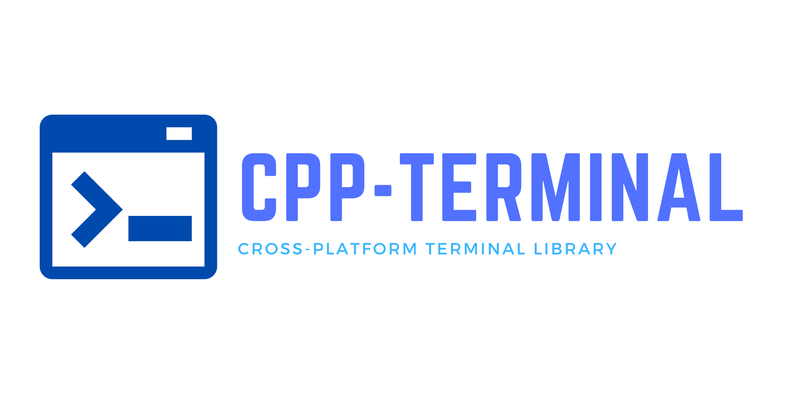

<p align="center">
  
</p>

[](https://github.com/jupyter-xeus/cpp-terminal/actions/workflows/linux.yml)
[](https://github.com/jupyter-xeus/cpp-terminal/actions/workflows/windows.yml)
[](https://github.com/jupyter-xeus/cpp-terminal/actions/workflows/macOS.yml)
[](https://github.com/jupyter-xeus/cpp-terminal/actions/workflows/codeql-analysis.yml)
[](https://github.com/jupyter-xeus/cpp-terminal/actions/workflows/pre-commit-check.yml)
[](https://results.pre-commit.ci/latest/github/jupyter-xeus/cpp-terminal/maset)

`CPP-Terminal` is a small and dependency-free C++ library for writing platform independent terminal-based applications. It follows the "Zero-overhead principle" and limits externally included files to the C++ STL. Being crossplatform we are currently supporting Windows, Linux and MacOS and are providing an unified API across all platforms. Our main features are consisting of Colors, Keyboard input, terminal resize handling, as well as other common terminal functionality. It's also possible to open a managed terminal from a windows GUI application.

## Hello World example

To write a simple Hello World program, all you need to do is:

```cpp
#include "cpp-terminal/io.hpp"

#include <iostream>

int main()
{
  std::cout << "\033[31mHello world !\033[0m" << std::endl;
  return 0;
}
```

or

```cpp
#include "cpp-terminal/io.hpp"
#include "cpp-terminal/color.hpp"

#include <iostream>

int main()
{
  std::cout << Term::color_fg(Term::Color::Name::Red)<<"Hello world !"<<color_fg(Term::Color::Name::Default)<< std::endl;
  return 0;
}
```

On windows you can simply create or attach a console through a GUI application by doing:

```cpp
#include "cpp-terminal/io.hpp"
#include "cpp-terminal/color.hpp"

#include <iostream>
#include <windows.h>

int __stdcall WinMain(HINSTANCE hinst, HINSTANCE hprev, LPSTR cmdline, int show)
{
  std::cout << Term::color_fg(Term::Color::Name::Red)<<"Hello world !"<<color_fg(Term::Color::Name::Default)<< std::endl;
  return 0;
}
```

Until 2021, CPP-Terminal used to be a single header library. Now, CPP-Terminal consists out of multiple small and usage oriented headers:

- `cpp-terminal/base.hpp`: everything for basic Terminal control
- `cpp-terminal/input.hpp`: functions for gathering input
- `cpp-terminal/prompt.hpp`: some variations of different prompts
- `cpp-terminal/window.hpp`: a fully managed terminal window for terminal user interfaces (TUI)
- `cpp-terminal/version.hpp`: macros with cpp-terminal's version number

The library uses private header for platform dependent code:

- `cpp-terminal/private/conversion.hpp`: Various conversions
- `cpp-terminal/private/platform.hpp`: platform dependent code

CPP-Terminal tries to be a small and simple replacement for ncurses. This approach keeps the code small and maintainable, but also easy to extend it's functionality. We limit ourselves to a subset of features that work on all supported platforms without needing to worry about style differences or other changes. Any application written with `CPP-Terminal` will work everywhere out of the box natively, without emulation or extra work. The small codebase makes CPP-Terminal easy to debug and extend, as well as understanding what happens behind the scenes in the library's core.


## Examples
We have created serval examples to show possible use cases of CPP-Terminal and to get you started more quickly. Every example works natively on all platforms in the exact same way:
- [colors.cpp](examples/colors.cpp): basic color, style and unicode demo
- [kilo.cpp](examples/kilo.cpp): the [kilo](https://github.com/snaptoken/kilo-src) text editor
  ported to C++ and `CPP-Terminal` instead of using Linux specific API
- [menu.cpp](examples/menu.cpp): An interactive menu using only the contents of `cpp-terminal/base.hpp`
- [menu_window.cpp](examples/menu_window.cpp): An interactive menu using the fully managed windowing system from `cpp-terminal/window.hpp`
- [keys.cpp](examples/keys.cpp): Interactively shows the keys pressed

## Supported platforms

|     Platform      | Supported versions |                                                                Arch                                                                |                                  Compiler                                   | C++ standard |
|:-----------------:|:------------------:|:----------------------------------------------------------------------------------------------------------------------------------:|:---------------------------------------------------------------------------:|:------------:|
|      Windows      |   10 and higher*   |                                                            x86, x86_64                                                             | MSVC 2019, MSVC 2022, clang11, clang12, clang13, clang14, clang15, clang-cl | 11,14,17,20  |
|  (Windows) MSYS2  |   All supported    |                                                            x86, x86_64                                                             |                            ucrt , clang,  mingw                             | 11,14,17,20  |
|       MacOS       |         11         |                                                                                                                                    |          xcode11.7 xcode12.4 xcode12.5.1 xcode13 gcc10 gcc11 gcc12          | 11,14,17,20  |
|       MacOS       |         12         |                                                                                                                                    |                   xcode13.1 xcode13.2 xcode13.3 xcode13.4                   | 11,14,17,20  |
|       Linux       |   All supported    |                                                               x86_64                                                               |                 4.7<=GCC<= 12  3.5<=Clang<=15  intel-oneapi                 | 11,14,17,20  |
| Linux (dockcross) |   All supported    | arm64 armv5 armv5-musl armv5-uclibc armv6 armv7a, mips, mipsel-lts, s390x, ppc64le, xtensa-uclibc, x86, x64, x64-clang, x64-tinycc |                        4.7<=GCC<= 12  3.5<=Clang<=15                        | 11,14,17,20  |

> Windows versions prior Windows 10 are missing the Win32 API functionality for entering the "raw mode" and therefore
> won't work. They are also lacking ANSI support. See #173 for adding support to prior windows versions for MSVC / Win32.

## How to use

Adding CPP-Terminal to your own project is really easy. We have collected various ways with easy
how-to's [in our documentation](https://github.com/jupyter-xeus/cpp-terminal/wiki/Adding-CPP-Terminal-to-your-ptoject).

## Documentation [](https://github.com/jupyter-xeus/cpp-terminal/actions/workflows/docs.yml) ##

<h1 align="center">
  <a href="https://jupyter-xeus.github.io/cpp-terminal/">

  ```markdown
  🌍 Online
  ```

  </a>
  <a href="https://jupyter-xeus.github.io/cpp-terminal/cpp-terminal_Manual.pdf">

  ```markdown
  📖 PDF
  ```

  </a>
</h1>

## Contributing

Contributing to CPP-Terminal is highly appreciated and can be done in more ways than code. Extending it's functionality,
reporting or fixing bugs and extending the documentations are just a few of them.

## License

CPP-Terminal is licensed under the terms
of [the MIT License](https://github.com/jupyter-xeus/cpp-terminal/blob/master/LICENSE) by Ondřej Čertík.

## Projects using cpp-terminal

* [Lime](https://github.com/TobiasWallner/Lime)

## Similar Projects

### Colors

Libraries to handle color output.

C++:

* [rang](https://github.com/agauniyal/rang)

### Drawing

JavaScript:

* [node-drawille](https://github.com/madbence/node-drawille)

### Prompt

Libraries to handle a prompt in terminals.

C and C++:

* [readline](https://tiswww.case.edu/php/chet/readline/rltop.html)
* [libedit](http://thrysoee.dk/editline/)
* [linenoise](https://github.com/antirez/linenoise)
* [replxx](https://github.com/AmokHuginnsson/replxx)

Python:

* [python-prompt-toolkit](https://github.com/prompt-toolkit/python-prompt-toolkit)

### General TUI libraries

C and C++:

* [curses](https://en.wikipedia.org/wiki/Curses_%28programming_library%29) and [ncurses](https://www.gnu.org/software/ncurses/ncurses.html)
* [Newt](https://en.wikipedia.org/wiki/Newt_(programming_library))
* [termbox](https://github.com/nsf/termbox)
* [FTXUI](https://github.com/ArthurSonzogni/FTXUI)
* [ImTui](https://github.com/ggerganov/imtui)

Python:

* [urwid](http://urwid.org/)
* [python-prompt-toolkit](https://github.com/prompt-toolkit/python-prompt-toolkit)
* [npyscreen](http://www.npcole.com/npyscreen/)
* [curtsies](https://github.com/bpython/curtsies)

Go:

* [gocui](https://github.com/jroimartin/gocui)
* [clui](https://github.com/VladimirMarkelov/clui)
* [tview](https://github.com/rivo/tview)
* [termbox-go](https://github.com/nsf/termbox-go)
* [termui](https://github.com/gizak/termui)
* [tcell](https://github.com/gdamore/tcell)

Rust:

* [tui-rs](https://github.com/fdehau/tui-rs)

JavaScript:

* [blessed](https://github.com/chjj/blessed) and [blessed-contrib](https://github.com/yaronn/blessed-contrib)
